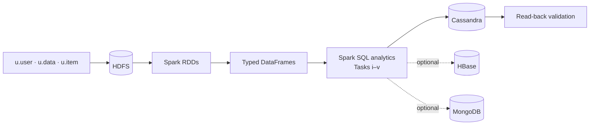

# MovieLens 100k — Big Data Pipeline (Spark · Cassandra · HBase · MongoDB)

An end-to-end analytical data-engineering pipeline on the
[MovieLens 100k](https://grouplens.org/datasets/movielens/) dataset, built on
**HDFS → Apache Spark (PySpark) → Apache Cassandra**, with read-back validation and an
optional **HBase + MongoDB** replication. The same pipeline is delivered in two runnable forms:
a full single-node cluster notebook and a self-contained Google Colab notebook.

> All result figures in this repository are **verified** from a real end-to-end run on
> MovieLens 100k — see [`docs/RESULTS.md`](docs/RESULTS.md).

## Architecture



Flow: the three raw files are landed in **HDFS**, parsed via **RDDs** (with explicit latin-1
handling for `u.item`), lifted into **typed DataFrames**, cleaned, analysed with **Spark SQL**,
persisted to query-first **Cassandra** tables, and **read back** to prove the writes. The same
results are optionally replicated on **HBase** and **MongoDB**.

## Repository layout

```
.
├── README.md                     ← this file (project landing page)
├── requirements.txt              ← Python dependencies
├── .gitignore
├── notebooks/
│   ├── movielens_pipeline.ipynb        ← main cluster notebook (HDFS + Cassandra + extensions)
│   ├── movielens_pipeline_colab.ipynb  ← self-contained Google Colab notebook
│   ├── genres.py                       ← canonical 19 genre columns (imported by the notebook)
│   └── schemas.py                      ← explicit Spark schemas (imported by the notebook)
├── scripts/
│   └── start-movielens.sh        ← one-command per-session startup for WSL2
└── docs/
    ├── HOW_TO_RUN.md             ← run guide for both options
    ├── SETUP_WINDOWS_WSL.md      ← full Windows-11 / WSL2 cluster setup (incl. HBase/MongoDB)
    ├── REPRODUCIBILITY.md        ← environment, versions, reproducibility steps
    ├── RESULTS.md                ← verified findings + interpretation summary
```

> `genres.py` and `schemas.py` live **beside** the cluster notebook on purpose: the notebook
> imports them (`from genres import ...`, `from schemas import ...`), so they must share its
> working directory. The Colab notebook generates its own copies at runtime.

## Quick start

**Option A — Google Colab (fastest, nothing to install).** Upload
`notebooks/movielens_pipeline_colab.ipynb` to [Colab](https://colab.research.google.com) and
select *Runtime ▸ Run all*. HDFS, Cassandra and the helper modules are all created in-session.

**Option B — local / WSL2 cluster.** Follow [`docs/SETUP_WINDOWS_WSL.md`](docs/SETUP_WINDOWS_WSL.md)
once, then each session run:

```bash
~/start-movielens.sh        # SSH → HDFS → Cassandra (→ HBase/MongoDB) → Jupyter
```

Full step-by-step for both options is in [`docs/HOW_TO_RUN.md`](docs/HOW_TO_RUN.md).

## Analytical tasks

| # | Task | Headline result |
|---|---|---|
| i | Average rating per movie | 1,682 movies scored; support highly uneven |
| ii | Top 10 movies (≥50-rating threshold) | *A Close Shave (1995)* — 4.491 (n=112) |
| iii | Power users (≥50 ratings) + favourite genre | 568 power users; Drama-dominated |
| iv | Users younger than 20 | 77 users (youngest 7) |
| v | Scientists aged 30–40 inclusive | 16 users |

Detailed numbers, charts and discussion are in the notebooks and [`docs/RESULTS.md`](docs/RESULTS.md).

## Technology stack

| Layer | Component | Version |
|---|---|---|
| Storage (distributed FS) | Apache Hadoop / HDFS | 3.3.6 |
| Compute | Apache Spark / PySpark | 3.5.1 (Scala 2.12) |
| Serving DB | Apache Cassandra | 4.1.4 (connector 3.5.0) |
| Extension | Apache HBase + `happybase` | 2.5.8 / 1.2.0 |
| Extension | MongoDB + mongo-spark-connector | 7.0 / 10.3.0 |
| Runtime | Java (OpenJDK) / Python | 11 / 3.10 |

## Technical-requirements coverage

| # | Requirement | Where |
|---|---|---|
| 1 | Spark + Cassandra imports / session | Notebook §1–2 |
| 2 | Load & parse files into HDFS | Notebook §3 (+ `scripts/start-movielens.sh`) |
| 3 | Create RDDs | Notebook §4 |
| 4 | RDDs → DataFrames with explicit schemas | Notebook §5 + `schemas.py` |
| 5 | Cleaning / preprocessing (justified) | Notebook §6 |
| 6 | Analytical queries (Spark SQL) | Notebook Tasks i–v |
| 7 | Cassandra keyspace/tables + writes | Notebook §7–8 |
| 8 | Read-back validation | Notebook §9 |
| 9 | Clean tables + visualisations | Notebook (charts in Tasks ii–iii) |
| 10 | Interpretation/discussion per task | Notebook interpretation cells + Discussion & Limitations |

## License / attribution

The MovieLens 100k dataset is provided by [GroupLens](https://grouplens.org/datasets/movielens/)
under its own terms and is **not** redistributed in this repository (it is downloaded at runtime).
